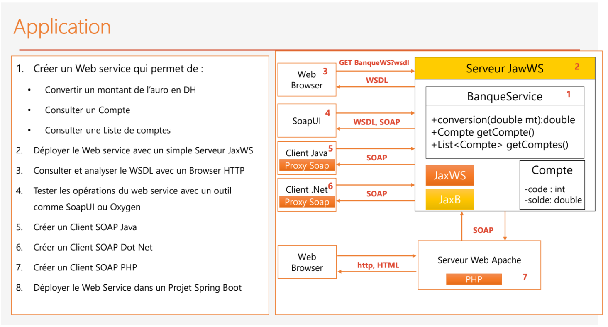

# SOAP Webservice

**Content**
1. [basics](#)
2. [Demo](#demo)


---------------------

## soap-java-webservice




--------------

## DEMO
### Creating the Server

#### Dependencies 
- In a Simple Java Project we add.

```xml
    <dependency>
        <groupId>com.sun.xml.ws</groupId>
        <artifactId>jaxws-ri</artifactId>
        <version>4.0.0</version>
        <type>pom</type>
    </dependency>
```
- Here we will not use Tomcat , but we will create our own Java Web Server

Here is our webservice created :

```java
package me.elaamiri.webservice;

import jakarta.jws.WebMethod;
import jakarta.jws.WebParam;
import jakarta.jws.WebService;

import java.util.Date;
import java.util.List;

// this class is named POJO : Plain Old Java Object
@WebService(serviceName = "BankWS")
public class BankWebservice {
    @WebMethod(operationName = "covert")
    public double conversion(@WebParam(name = "amount") double amount){
        return amount * 10.42;
    }

    @WebMethod(operationName = "getAccount")
    public Account getAccount(@WebParam(name = "code") int code){
        return new Account(code, Math.random()*50042, new Date());
    }

    @WebMethod
    public List<Account> getAccounts(){
        return List.of(
                new Account(1, Math.random()*50042, new Date()),
                new Account(2, Math.random()*50042, new Date()),
                new Account(3, Math.random()*50042, new Date())
        );
    }

}

```

Now we should deploy it,
We will create our own Server

